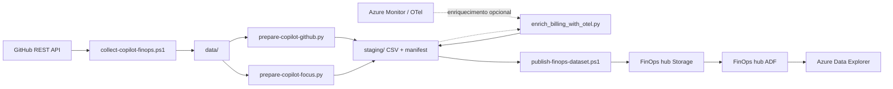

# GitHub Copilot FinOps for FinOps hubs

Extensão para coletar dados de GitHub Copilot, normalizá-los e publicá-los em um
[FinOps hub](https://learn.microsoft.com/cloud-computing/finops/toolkit/hubs/finops-hubs-overview)
com Azure Data Factory, Azure Storage e Azure Data Explorer.

O projeto publica dois datasets:

- `GitHubCopilot`: budgets, seats, uso diário e enriquecimento opcional com OTel.
- `GitHubCopilotFocus`: custos reais de AI credits em formato FOCUS com extensões `x_AI*`.

Dados coletados e CSVs gerados são locais e estão excluídos do Git. O repositório
não contém organização, subscription ID, nomes de recursos Azure ou credenciais.

## Fluxo



## Pré-requisitos

- PowerShell 7, Python 3.10 ou superior, GitHub CLI e Azure CLI.
- Um FinOps hub existente com os bancos `Ingestion` e `Hub` e o pipeline ADF
  `msexports_ExecuteETL`.
- `gh auth login` com acesso aos endpoints de billing, seats e métricas da organização.
- `az login` com RBAC suficiente para Data Factory, blobs e comandos de gerenciamento ADX.
- Autenticação por identidade e RBAC. Nenhum script aceita storage key ou segredo embutido.

Instale as dependências a partir da raiz do projeto:

```powershell
python -m venv .venv
.\.venv\Scripts\Activate.ps1
python -m pip install -r requirements.txt
```

## Implantação

Defina os valores do seu ambiente na sessão, sem gravá-los no repositório:

```powershell
$subscriptionId = "<azure-subscription-id>"
$resourceGroup = "<finops-hub-resource-group>"
$factoryName = "<data-factory-name>"
$storageAccount = "<storage-account-name>"
$clusterUri = "https://<adx-cluster>.<region>.kusto.windows.net"
```

Crie tabelas, mappings, policies e funções públicas:

```powershell
.\deploy-kusto-file.ps1 -Database Ingestion -Path .\kusto\Ingestion\GitHubCopilot.kql -ClusterUri $clusterUri
.\deploy-kusto-file.ps1 -Database Hub -Path .\kusto\Hub\GitHubCopilot.kql -ClusterUri $clusterUri
.\deploy-kusto-file.ps1 -Database Ingestion -Path .\kusto\Ingestion\GitHubCopilotFocus.kql -ClusterUri $clusterUri
.\deploy-kusto-file.ps1 -Database Hub -Path .\kusto\Hub\GitHubCopilotFocus.kql -ClusterUri $clusterUri
```

Envie os mappings CSV para o container de configuração e registre os aliases no ADF:

```powershell
.\deploy-adf-github-copilot.ps1 `
    -SubscriptionId $subscriptionId `
    -ResourceGroupName $resourceGroup `
    -FactoryName $factoryName `
    -StorageAccountName $storageAccount
```

Use `-ValidateOnly` nesse comando para validar mappings e roteamento sem alterar o ADF.

## Coleta e preparação

Colete os dados de uma organização:

```powershell
.\collect-copilot-finops.ps1 -Organization "<github-organization>" -Days 28
```

Prepare o dataset operacional unificado:

```powershell
python .\prepare-copilot-github.py
```

Prepare o dataset FOCUS. Ele usa somente itens reais retornados por
`billing/ai_credit/usage`; zero linhas é um resultado válido quando não há charges:

```powershell
python .\prepare-copilot-focus.py
```

Os preparadores selecionam a coleta completa mais recente em `data/` e escrevem
um CSV e um `manifest.json` em `staging/`. Use `--run-directory` para escolher
uma execução específica.

## Enriquecimento OTel

O enriquecimento consulta Azure Monitor e tenta correlacionar telemetria por
data, organização e usuário, conforme os identificadores realmente disponíveis.
Revise o mapeamento exibido antes de confirmar o merge.

```powershell
python .\enrich_billing_with_otel.py `
    --rest-csv "<artifact-directory>\<source.csv>" `
    --existing-manifest "<artifact-directory>\manifest.json" `
    --output-csv "<artifact-directory>\<enriched.csv>" `
    --output-manifest "<artifact-directory>\manifest.json" `
    --workspace-id "<log-analytics-workspace-id>"
```

Também é possível usar `--resource-id` para consultar um Application Insights
em vez de `--workspace-id`. O script não inventa identidade de usuário, tokens,
modelos ou agentes quando a telemetria não oferece correlação determinística.

## Publicação

Valide o artefato antes de enviar:

```powershell
.\publish-finops-dataset.ps1 `
    -StorageAccountName $storageAccount `
    -ArtifactDirectory "<artifact-directory>" `
    -ValidateOnly
```

Publique depois da validação:

```powershell
.\publish-finops-dataset.ps1 `
    -StorageAccountName $storageAccount `
    -ArtifactDirectory "<artifact-directory>"
```

O manifest é enviado por último para disparar o ADF. Use `-Replace` somente
quando quiser substituir todos os blobs da mesma partição do dataset.

## Verificação no ADX

Execute estas consultas separadamente no banco `Hub`:

```kusto
GitHubCopilotLicenseSummary()
```

```kusto
GitHubCopilotBudgets()
| summarize Budgets = count(), TotalBudget = sum(BudgetAmount)
```

```kusto
GitHubCopilotFocus()
| summarize Rows = count(), BilledCost = sum(BilledCost)
```

## Estrutura

| Caminho | Finalidade |
| --- | --- |
| `collect-copilot-finops.ps1` | Coleta billing, budgets, seats e relatórios de uso do GitHub. |
| `prepare-copilot-github.py` | Normaliza budgets, seats e uso no dataset `GitHubCopilot`. |
| `prepare-copilot-focus.py` | Normaliza charges reais de AI credits no dataset FOCUS. |
| `enrich_billing_with_otel.py` | Agrega OTel do Azure Monitor e enriquece o CSV operacional. |
| `dataset_manifest.py` | Valida schemas e cria o envelope de manifest consumido pelo ADF. |
| `publish-finops-dataset.ps1` | Valida e envia CSV/manifest para o storage do FinOps hub. |
| `deploy-adf-github-copilot.ps1` | Publica mappings e adiciona aliases ao roteamento ADF. |
| `deploy-kusto-file.ps1` | Aplica comandos de gerenciamento Kusto via identidade Azure CLI. |
| `schemas/` | Contratos de coluna dos dois datasets. |
| `config/schemas/` | Mappings `TabularTranslator` usados na conversão CSV para Parquet. |
| `kusto/Ingestion/` | Tabelas raw/final, mappings, transforms e update policies. |
| `kusto/Hub/` | Funções públicas para consumo e dashboards. |
| `kusto/Dashboard/` | Consultas prontas para painéis de budgets e licenças. |
| `docs/github-focus-mapping.md` | Decisões semânticas e limites do mapeamento FOCUS. |
| `generate_synthetic_*.py` | Dados exclusivamente fictícios para demonstração. |
| `tests/` | Testes de contratos de transformação e manifest. |

## Dados e segurança

- Nunca versione `data/`, `staging/`, CSVs, `.env`, logs ou ambientes virtuais.
- Trate logins, seats, consumo, budgets e telemetria como dados organizacionais sensíveis.
- Revise os papéis RBAC e use o menor escopo possível.
- Os geradores sintéticos usam `Synthetic-Demo` para manter demonstrações separadas
  de organizações reais; seus valores não representam preços ou consumo do GitHub.
- `ConsumedAmount` de budget não é custo FOCUS. Consulte
  `docs/github-focus-mapping.md` antes de alterar o mapeamento financeiro.